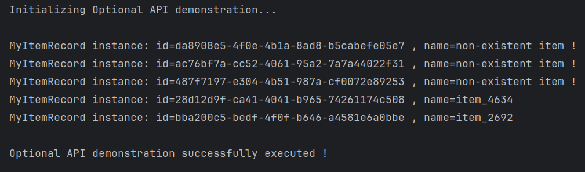
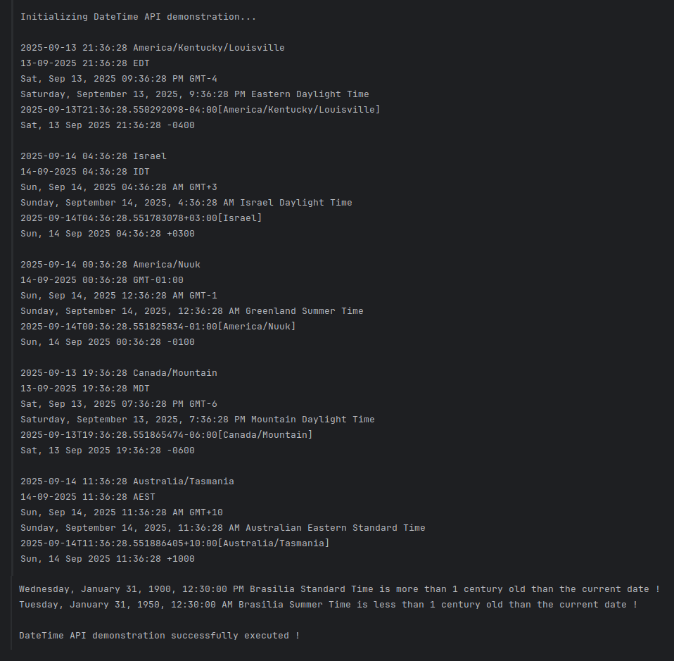
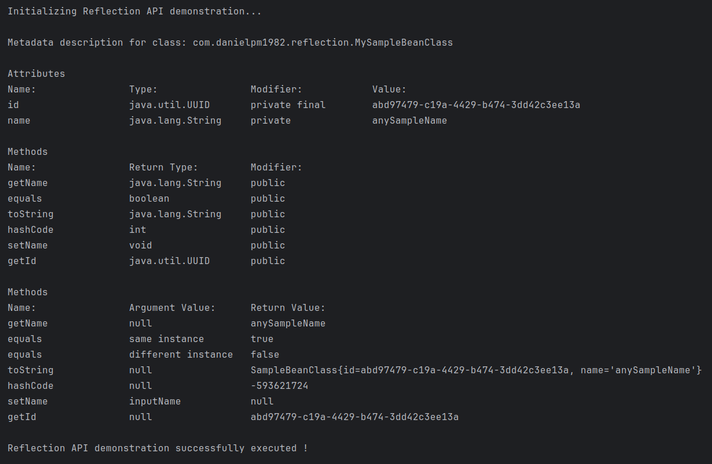
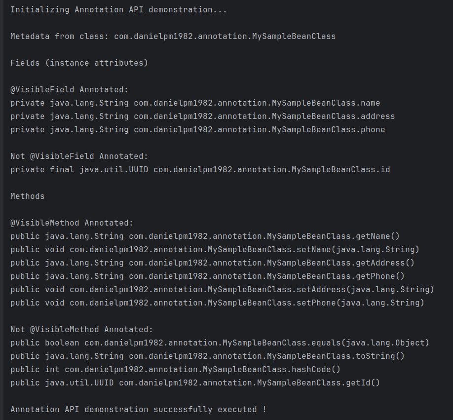
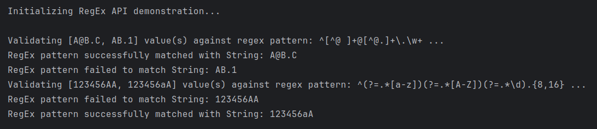
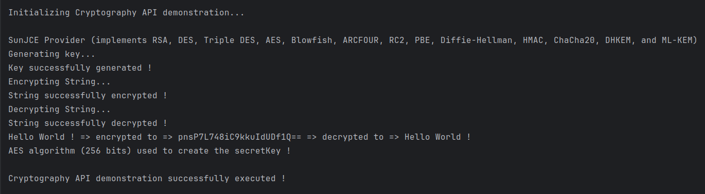
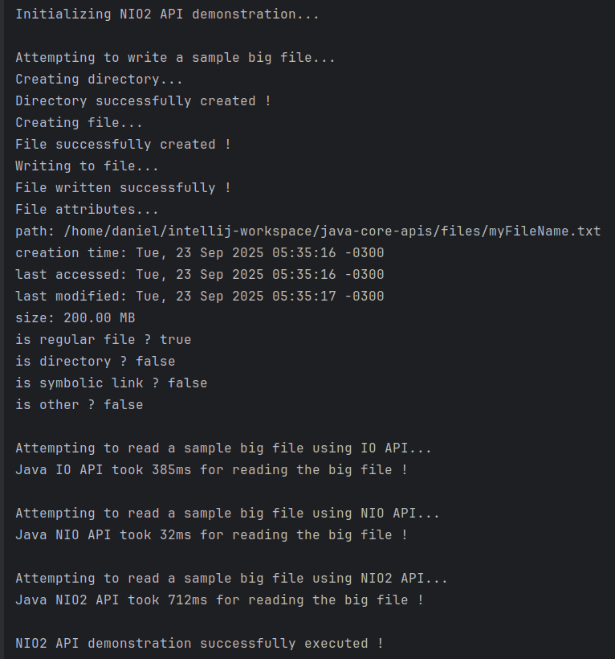

# java-core-apis

This is a simple Java 25 console app repo that exemplifies how to work with the most important Java core APIs

© 2025 Daniel Pinheiro Maia All Rights Reserved 
(see Copyright© License at the end of this text).

[**Description of this repository**] 
This is a simple Java 25 console app repo that exemplifies how to work with the most important Java core APIs.

[**Content**] 
This project tackles some of the main Java 25 APIs, including, but not limited to:
- Optional
- DateTime
- Reflection
- Annotation
- RegEx
- Cryptography
- Stream
- Exception
- Logger
- Collection
- Input/Output (IO, NIO, NIO2)

[**Source Code and Run**] 
Source code available at github.com, through the following link: 
[https://github.com/danielpm1982/java-core-apis](https://github.com/danielpm1982/java-core-apis)  
You can clone this project locally with you Git or import the repository directly to your IDE. The IDE used to create this project was IntelliJ Ultimate, but it should run on any IDE. If your IDE demands the creation of a module to run this project, as IntelliJ, you can simply do it by accessing the modules section, at the Projects Structure Setting of the IDE, and asking it to create the module, setting your local JDK or JRE at it. As modules involve individual custom configurations of your local environment, the .iml files shouldn't be pushed to the remote Git repository (or GitHub). Each person should create his own project modules. Also, as this is a project aimed at beginners, we've not used Maven nor Containerized the application. It's just simple Java classes, to be compiled and run by your Java 25 local installation.

[**Printscreen samples**] 

[**Support**] 
If you have any suggestion or correction about the content of this repository, please, feel free to open an issue at the project issues' section: 
https://github.com/danielpm1982/java-core-apis/issues

[**Copyright© License**] 
© 2025 Daniel Pinheiro Maia All Rights Reserved 
This GitHub repository - and all code (software) available inside - is exclusively for academic and individual learning purposes, and is **NOT AVAILABLE FOR COMMERCIAL USE**, nor has warranty of any type. You're authorized to fork, clone, run, test, modify, branch and merge it, at your own risk and using your own GitHub account, for individual learning purposes only, but you're **NOT ALLOWED to distribute, sublicense and/or sell copies of the whole or of parts of it** without explicit and written consent from its owner / author. You can fork this repository to your individual account at GitHub, clone it to your personal notebook or PC, analyse, run and test its code, modify and extend it locally or remotely (exclusively at your own GitHub account and as a forked repository), as well as send issues or pull-requests to this parent (original) repository for eventual approval. GitHub is in charge of explicitly showing whom this respository has been forked from. **If you wish to use any of this repository content in any way other than what is expressed above, or publish it anyway or anywhere other than as a forked repository at your own GitHub account, please contact this repository owner / author** using GitHub or the contact info below. For the meaning of the technical terms used at this license, please refer to GitHub documentation, at https://help.github.com/en/github .

[**Owner and Author of this GitHub Repository**] 
Daniel Pinheiro Maia 
[danielpm1982.com](https://www.danielpm1982.com) 
danielpm1982@gmail.com 
[linkedin.com/in/danielpm1982](https://www.linkedin.com/in/danielpm1982) 
Brazil 
.
